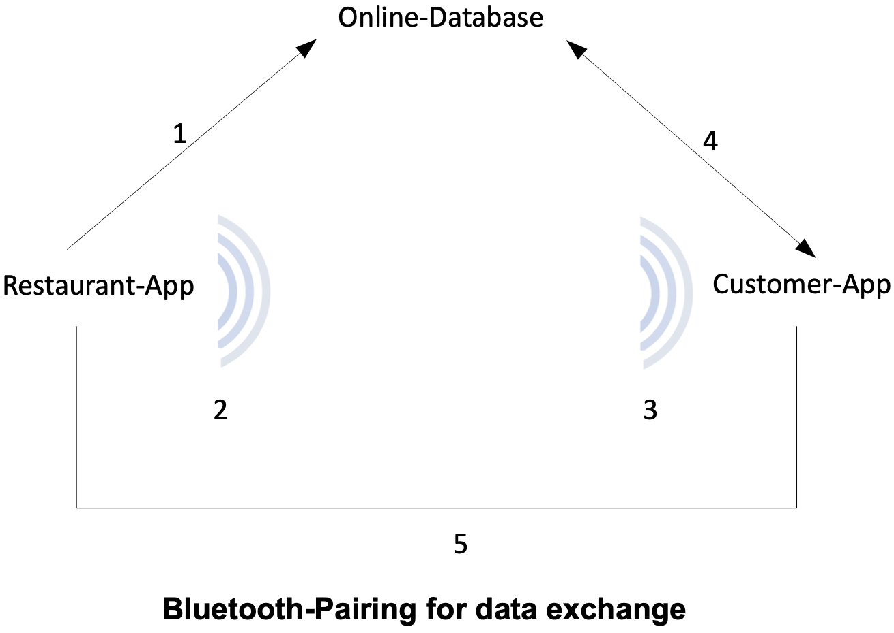

# COVID Check-In

## Purpose

**COVID Check-In**'s idea is an easy way to exchange contact data with places (e.g. restaurant) in the current pandemic. The main identification of this app is that user interaction is very minimal and user data is not stored on any server but on local devices at the visited place. When a user accepts the whole data transfer process is performed automatically.

## Concept

The system consists of two apps: **COVID Check-In** and **COVID Check-In: Restaurant Edition** (Both can be found in this repo implemented as two different [app flavors](https://developer.android.com/studio/build/build-variants)).

The latter of the two works as a bluetooth beacon and should be enabled while the place is open. Owners of places with a check-in can configure their information inside the app which sends the meta-data to a central server. This is needed beacuse of the technical restrictions of Bluetooth Low Energy (BLE) which does not enables transmitting meta-data such as place names.

Users of **COVID Check-In** can install the app and enter their contact data initially. From then the app runs in the background and listens for Bluetooth LE packages of the restaurant pendant. If a bluetooth beacon is detected the app downloads the meta data from a [firebase firestore](https://firebase.google.com/docs/firestore) and sends a push notification. If users afterwards confirm sharing their contact information with the restaurant a bluetooth connection between the restaurant's device and the user's one is established and data transmitted.

